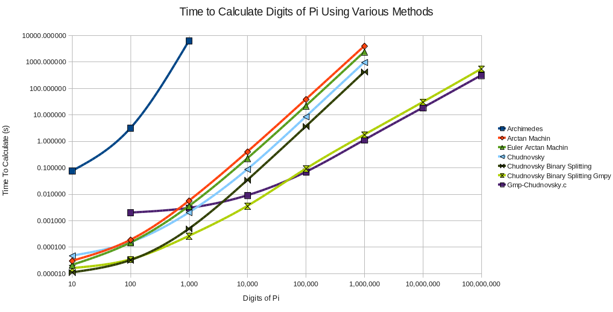
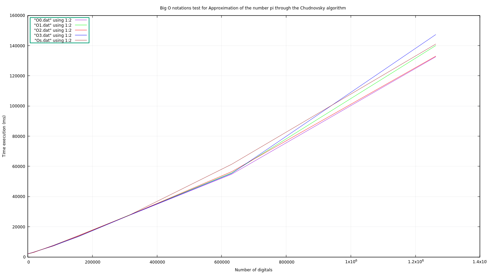

Big O notations test for calculate digits of the PI number 
---------------------------------------------------------------------------------
Algorithm uses your amount and calculates an approx value of number PI.

The main implementation is based on [Chudovsky algorithm](https://en.wikipedia.org/wiki/Chudnovsky_algorithm])
 
Author of the implementation: [click](https://github.com/g-andrade/chudnovsky-demo)

The results will be saved in current directory.
 
Firstly you should run **sudo apt-get install libgmp3-dev**
Run program:

- make all

Usage:

- ./sort <number of symbols>  filename.dat]

### See [**results**](https://github.com/Jayawardenepura/GL-C-Embeedded/tree/master/O-notation-tests/calculating-PI/results)

### clean
- make clean

 

data for  **O0,O1,O2,O3,Os** notations:
 
