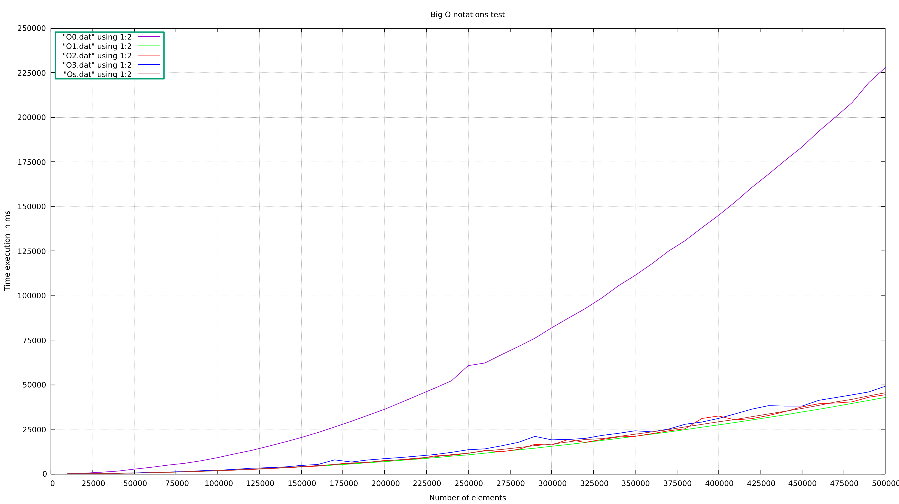

Empirical test of the "BIG O" notation and gcc optimization flags of the **Insertion sort**

**The code has a next steps**:
- Pseudorandom generating of array numbers. 
- Sorting array by Insertion sort algorithm.
- Filling array by time execution of sort.
- Creating output file with results.(You can visualize your results by gnuplot).

## See 

## Execute:
- make all

Usage:

- ./yourprogram "Max value" "Amount of points" "youfileOutput.dat" 

### Clean
- make clean

The results:

